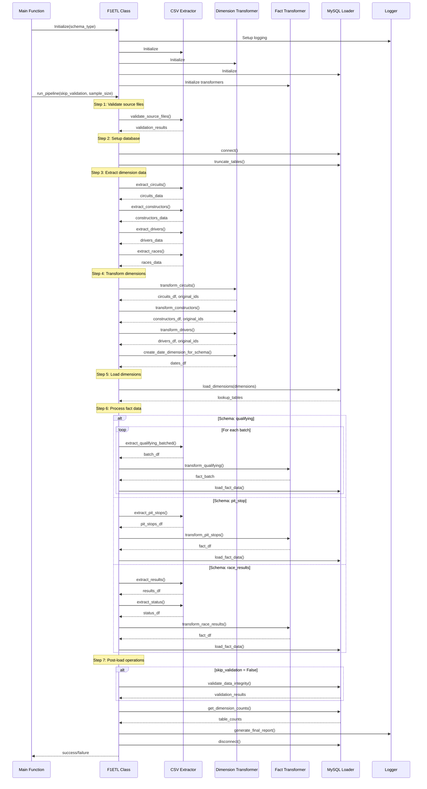

# F1 ETL Pipeline Diagrams

This document contains sequence and flow diagrams for the F1 ETL pipeline implemented in `run_etl.py`.

## Sequence Diagram

The sequence diagram shows the detailed interaction between components during the ETL process:

## Flow Diagram

The flow diagram provides a high-level overview of the entire ETL process:

```mermaid
flowchart TD
    A[Start: Main Function] --> B[Parse Command Line Arguments]
    B --> C[Create Logs Directory]
    C --> D[Initialize F1ETL with Schema Type]
    
    D --> E[Setup Logging & Components]
    E --> F[Configure Schema Settings]
    F --> G[Run ETL Pipeline]
    
    G --> H[Step 1: Validate Source Files]
    H --> I{All Files Valid?}
    I -->|No| Z[Log Error & Exit]
    I -->|Yes| J[Step 2: Setup Database]
    
    J --> K[Connect to MySQL]
    K --> L[Truncate Tables]
    L --> M[Step 3: Extract Dimension Data]
    
    M --> N[Extract Circuits]
    N --> O[Extract Constructors]
    O --> P[Extract Drivers]
    P --> Q[Extract Races]
    Q --> R[Step 4: Transform Dimensions]
    
    R --> S[Transform Circuits]
    S --> T[Transform Constructors]
    T --> U[Transform Drivers]
    U --> V[Create Date Dimension]
    V --> W{Schema Type?}
    
    W -->|pit_stop or race_results| X[Transform Races]
    W -->|qualifying| Y[Step 5: Load Dimensions]
    X --> Y
    
    Y --> AA[Load All Dimensions to DB]
    AA --> BB[Create Lookup Tables]
    BB --> CC[Step 6: Process Fact Data]
    
    CC --> DD{Schema Type?}
    
    DD -->|qualifying| EE[Process Qualifying Batched]
    DD -->|pit_stop| FF[Process Pit Stops Full]
    DD -->|race_results| GG[Process Race Results Full]
    
    EE --> HH[For Each Batch]
    HH --> II[Extract Batch from CSV]
    II --> JJ[Transform Batch]
    JJ --> KK[Load Batch to DB]
    KK --> LL{More Batches?}
    LL -->|Yes| HH
    LL -->|No| MM[Step 7: Post-Load Operations]
    
    FF --> NN[Extract Pit Stops]
    NN --> OO[Transform Pit Stops]
    OO --> PP[Load to DB]
    PP --> MM
    
    GG --> QQ[Extract Results & Status]
    QQ --> RR[Transform Race Results]
    RR --> SS[Load to DB]
    SS --> MM
    
    MM --> TT{Skip Validation?}
    TT -->|No| UU[Validate Data Integrity]
    TT -->|Yes| VV[Get Table Counts]
    UU --> VV
    
    VV --> WW[Generate Final Report]
    WW --> XX[Cleanup Resources]
    XX --> YY[Return Success/Failure]
    
    YY --> ZZ[Exit with Status Code]
    
    style A fill:#e1f5fe
    style ZZ fill:#c8e6c9
    style Z fill:#ffcdd2
    style G fill:#fff3e0
    style H fill:#f3e5f5
    style M fill:#f3e5f5
    style R fill:#f3e5f5
    style Y fill:#f3e5f5
    style CC fill:#f3e5f5
    style MM fill:#f3e5f5
```

## Key Features of the F1 ETL Pipeline

### Architecture
- **Multi-Schema Support**: Handles three different F1 data schemas (qualifying, pit_stop, race_results)
- **Dimension-Fact Architecture**: Implements proper dimensional modeling with separate dimension and fact tables
- **Batch Processing**: For large datasets (qualifying), processes data in batches to manage memory efficiently

### Process Flow
1. **Validation**: Validates source CSV files before processing
2. **Database Setup**: Connects to MySQL and prepares tables
3. **Dimension Processing**: Extracts, transforms, and loads dimension data
4. **Fact Processing**: Processes fact data based on schema type (batched for qualifying, full for others)
5. **Post-Load Operations**: Validates data integrity and generates reports

### Error Handling
- Comprehensive error handling with detailed logging
- Graceful degradation for batch processing failures
- Validation of data integrity with optional skipping

### Performance Features
- Memory-efficient batch processing for large datasets
- Progress tracking and performance metrics
- Configurable sample sizes for testing

### Command Line Options
- `--schema`: Choose between qualifying, pit_stop, or race_results
- `--skip-validation`: Skip data integrity validation
- `--sample-size`: Process only N records for testing
